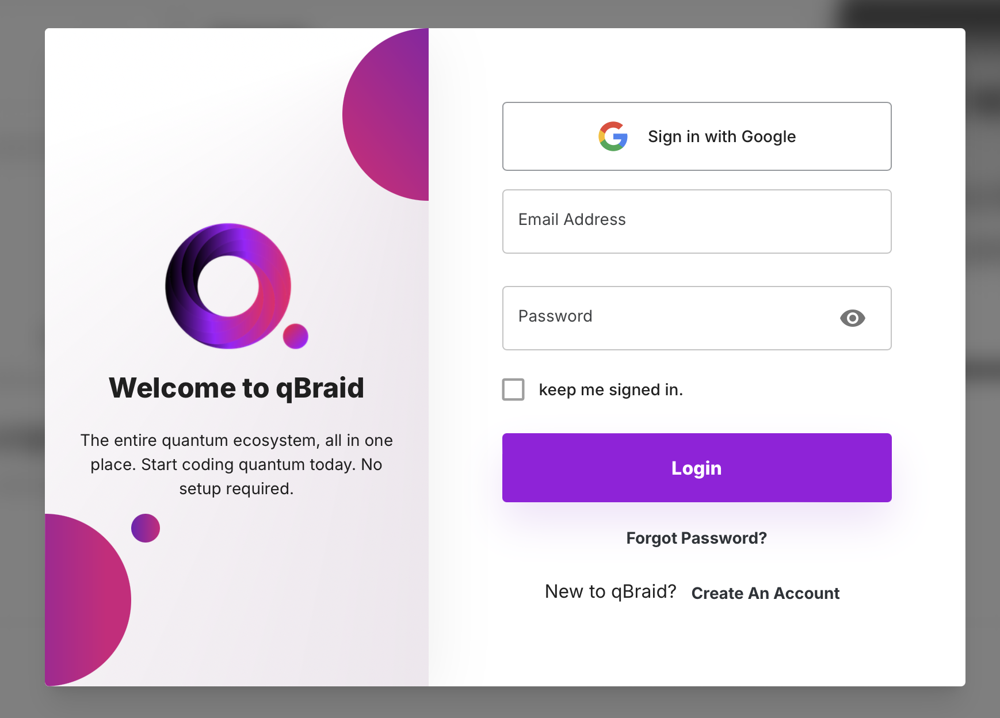
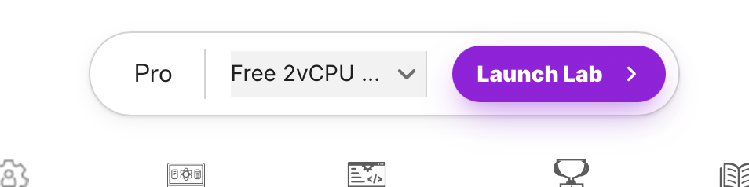
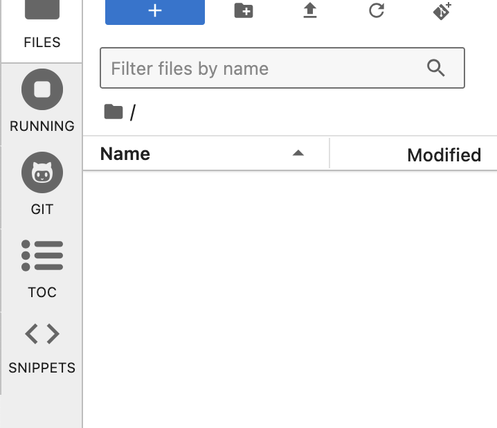
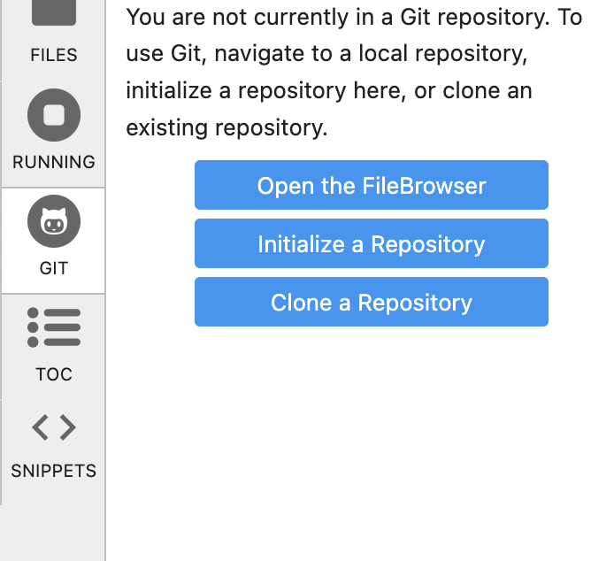

# Introduction to qBraid

This repository contains a collection of examples and tutorial files on how to get started with using qBraid. It includes simple hands on examples illustrating how to connect to qBraid, how to launch a Jupyter Lab notebook hosted by qBraid and submitting circuits for execution on quantum computers.

This repository was developed for CE 395/495 Secure Quantum Computing course at Northwestern University offered by Prof. Jakub Szefer in Spring 2025. The examples are geared towards quantum circuits useful in testing cross-talk and analysis of possible security weaknesses in NISQ quantum computers.

The examples assume you have qBraid Credits to execute jobs on quantum computers or can purchase the credits or are given the credits as part of an organization. The examples further assume you will be requesting access to be part of an organization through qBraid and will receive qBraid Credits.

## Quick Start for Logging into qBraid Lab

### Log Into Your Account

To begin using quantum computers through qBraid you need to have an account and log into your qBraid Account. Navigate to <https://account.qbraid.com> to log into your account:

For the CE 395/495 course, if you do not have an account, please create an account with your Northwestern University student email address.

### Request Access to an Organization

For the CE 395/495 course, contact the instructor to request to be added to the Northwestern organization. You will then receive an email invitation that you need to accept. Once part of the organization, we will be able to assing your qBraid credits.

### Launch qBraid Lab

Programming quantum circuits and submitting them for execution on quantum computers can be done via the qBraid Lab. qBraid Lab is a Jupyter Lab notebook that is hosted on servers provided by qBraid. The notebooks can be launched on different types of compute instances, depending on how much compute power (CPUs) and memory (DRAM) you need for your work. For most examples, the free two virtual CPU (2vCPU) instance is sufficient for most examples in this repository.

You can launch your qBraid Lab by pressing Launch Lab button at top of your <https://account.qbraid.com> page:

### Clone You Project Repository within qBraid Lab

It is recommended (and required for CE 395/495 course) that you have a GitHub repsoitory where you keep all your code. When you have started qBraid Lab, you will see empty workspace with now files:

Press the Git icon on the left side and then press Clone a Repository to clone your files into the notebook:

When cloning a GitHub repository, you will need the URI of the repository as well as personal access token. More information on how to create a personal access token is provided by GitHub at <https://docs.github.com/en/authentication/keeping-your-account-and-data-secure/managing-your-personal-access-tokens#creating-a-personal-access-token-classic>

### Clone This Tutorial Repository within qBraid Lab

You can also clone this repository within qBraid Lab so you can access the files more easily. Follow the prior steps to clone theis repository. The URI of this tutorial repository is <https://github.com/caslab-code/qc-qbraid-introduction.git> and it is a public repository that should not require an access token.

### Ready to Code

Now you should be ready do code! You should have a running qBraid Lab instance with your project cloned so you can save your code. You should also have clone of this tutorial repository so you can access its files.

## Contribution

Contributions to this repository are welcome from anyone! If you encounter any issues or would like to contribute improvements, please open an issue or submit a pull request.